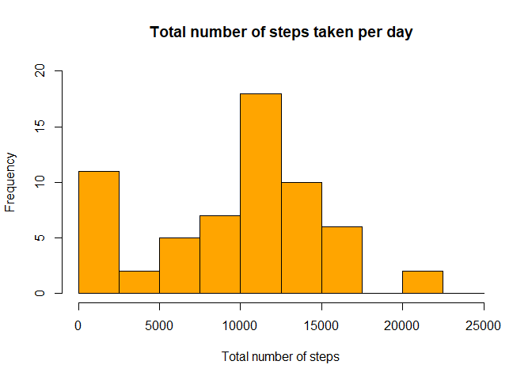
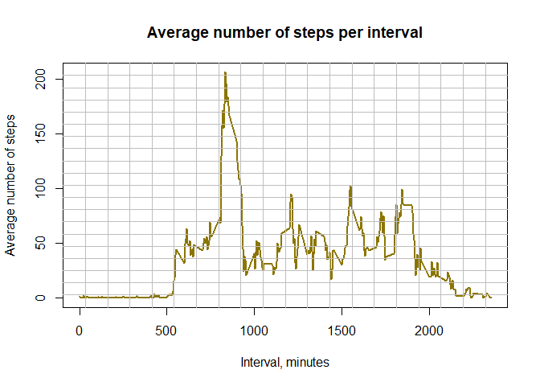
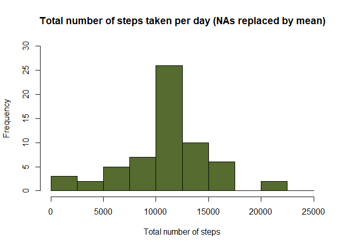
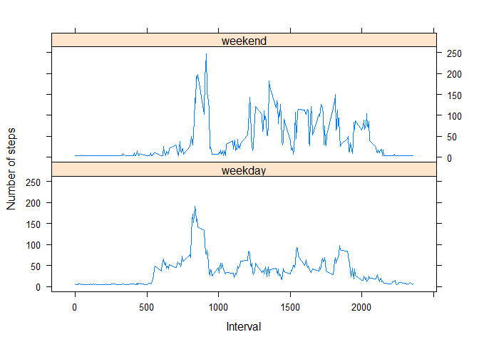

## Loading and preprocessing the data

1. Unzip and load the data

```r
# Use lubridate library for getting weekday
library(lubridate)
```

```
## 
## Attaching package: 'lubridate'
```

```
## The following object is masked from 'package:base':
## 
##     date
```

```r
# unzip and load the unprocessed data
path <- getwd()
unzip(zipfile = paste(path, "activity.zip", sep = "/"))
unprocessed <- read.csv("activity.csv", stringsAsFactors=FALSE)
```

2. Process the data

```r
# Process and transform the data
unprocessed$date <- as.Date(unprocessed$date)
unprocessed <- cbind(unprocessed, daytype=ifelse((wday(unprocessed$date) - 1) >=  6, "weekend", "weekday"))
activity <- data.frame(date=unprocessed$date, 
                       daytype=unprocessed$daytype, 
                       interval=unprocessed$interval,
                       steps=unprocessed$steps)
```
Processed activity data looks like this: 

```
##         date daytype interval steps
## 1 2012-10-01 weekday        0    NA
## 2 2012-10-01 weekday        5    NA
## 3 2012-10-01 weekday       10    NA
## 4 2012-10-01 weekday       15    NA
## 5 2012-10-01 weekday       20    NA
## 6 2012-10-01 weekday       25    NA
```

## What is mean total number of steps taken per day?

3. Calculate the mean total number of steps taken per day

```r
# Calculate total steps per day, remove NAs
steps <- aggregate(activity$steps, by=list(activity$date), FUN=sum, na.rm=TRUE)

# Rename the columns
names(steps) <- c("date", "total")
```

4. Plot histogram of the total number of steps per day

```r
# Plot histogram of the total number of steps per day
hist(steps$total, breaks=seq(from=0, to=25000, by=2500), col="orange", 
     xlab="Total number of steps", ylim=c(0, 20), main="Total number of steps taken per day")
```

<!-- -->

The mean of the total number of steps is **9354** and the median is **10395**


## What is the average daily activity pattern?

5. Calculate the mean values over all steps taken on all the days

```r
# Calculate mean values over all steps taken on all the days
mean_steps <- aggregate(activity$steps, by=list(activity$interval), FUN=mean, na.rm=TRUE)

# Rename the columns
names(mean_steps) <- c("interval", "mean")
```
The data for mean steps looks like this: 

```
##   interval      mean
## 1        0 1.7169811
## 2        5 0.3396226
## 3       10 0.1320755
## 4       15 0.1509434
## 5       20 0.0754717
## 6       25 2.0943396
```

6. Plot time series of the 5-minute interval and the average number of steps taken, averaged across all days 

```r
# Plot time series of the 5-minute interval and the average number of steps taken, averaged across all days 
plot(mean_steps$interval, mean_steps$mean, type="l", col="gold4", lwd=2, 
     xlab="Interval, minutes", ylab="Average number of steps", 
     main="Average number of steps per interval")
grid (20,20, lty = 1, col = "gray")
```

<!-- -->

7. Find interval with maximum number of steps

```r
# Find interval with maximum number of steps
interval_with_max_steps <- mean_steps[which(mean_steps$mean == max(mean_steps$mean)), 1]
```

The 5-minute interval containing the maximum number of steps is **835**

## Imputing missing values

8. Calculate the total number of NA's

```r
totalNA <- sum(is.na(activity$steps))
```

The number of NA`s is **2304**

9. Find the positions of NA's in the dataset and replace the NA values with mean values

```r
# Find positions of NAs
positions <- which(is.na(activity$steps))

# Substitute NA values with a mean value
activity[positions, "steps"] <- mean(activity$steps, na.rm=TRUE)
```

Activity data with NA values replaced by mean value looks like this: 

```
##         date daytype interval   steps
## 1 2012-10-01 weekday        0 37.3826
## 2 2012-10-01 weekday        5 37.3826
## 3 2012-10-01 weekday       10 37.3826
## 4 2012-10-01 weekday       15 37.3826
## 5 2012-10-01 weekday       20 37.3826
## 6 2012-10-01 weekday       25 37.3826
```

10. Calculate total number of steps per day, NAs are replaced by mean value

```r
# Calculate total number of steps per day, NAs are replaced by mean value
total_steps <- aggregate(activity$steps, by=list(activity$date), FUN=sum)

# Rename the columns
names(total_steps) <- c("date", "total")
```

11. Plot histogram of the total number of steps per day

```r
# Plot histogram of the total number of steps per day
hist(total_steps$total, breaks=seq(from=0, to=25000, by=2500), col="darkolivegreen", 
     xlab="Total number of steps", ylim=c(0, 30), 
     main="Total number of steps taken per day (NAs replaced by mean)")
```

<!-- -->

The mean of the total number of steps is **10766** and the median is **10766**

The differences between the mean and median values calculated by *`substituting missing values with a mean value`* and the mean and median values calculated with *`missing values included`*, are **`significant`**. Imputing missing values gives us more data for analysis and of course the mean and median values are also different.

## Are there differences in activity patterns between weekdays and weekends?

12. Calculate the average number of steps taken, average across all daytypes

```r
# Load the lattice library
library(lattice)

# Compute the average number of steps taken, averaged across all daytypes
mean_values_by_daytype <- aggregate(activity$steps, by=list(activity$daytype, activity$interval), mean)

# Rename the columns
names(mean_values_by_daytype) <- c("daytype", "interval", "mean")
```

Activity data by daytype (weekday / weekend) looks like this: 

```
##   daytype interval     mean
## 1 weekday        0 6.654306
## 2 weekend        0 4.672825
## 3 weekday        5 5.276947
## 4 weekend        5 4.672825
## 5 weekday       10 5.069400
## 6 weekend       10 4.672825
```

13. A panel plot containing a time series plot of the 5-minute interval (x-axis) and the average number of steps taken

```r
xyplot(mean ~ interval | daytype, mean_values_by_daytype, type="l", lwd=1, 
       xlab="Interval", ylab="Number of steps", layout=c(1,2))
```

<!-- -->
